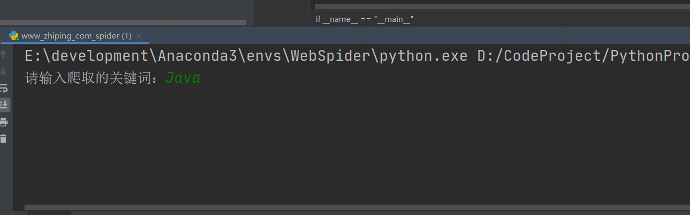
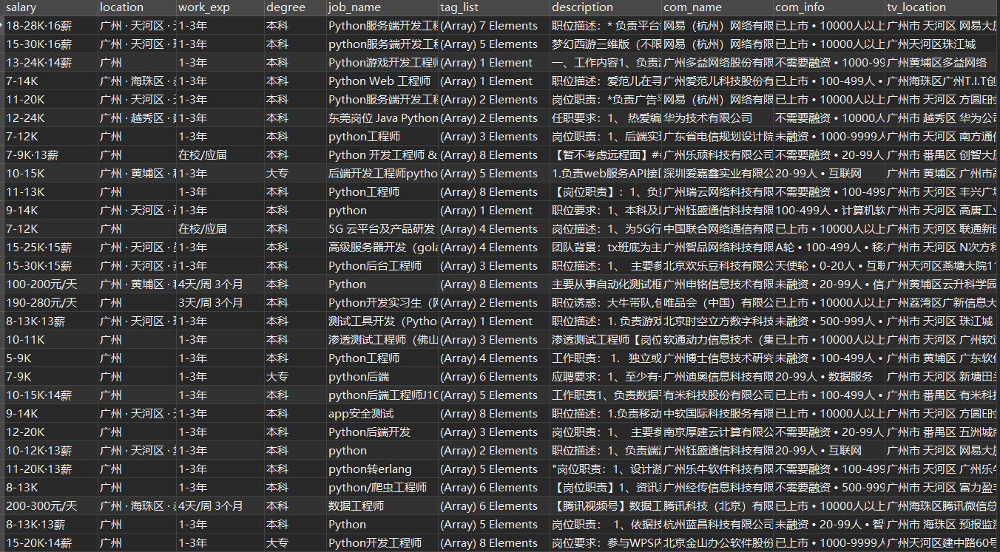

# boss直聘招聘信息爬取

 > ### 需求
 爬取boos职位详情、工资、公司地点等信息

 > ### 分析
 我们可以通过selenium模块去模拟用户在浏览器的操作，去爬取信息，但官网反爬虫机制越来越强大，很容易把ip封掉
 

 但我们可以通过uiautomator2模块自动化爬取boss直聘App，需要一部android手机和USB数据线连接电脑，打开android手机的USB调试模式，把boss直聘app放在首页，运行python脚本即可，然后把爬取到的结果存入MongoDB

 虽然此方案爬取效率不是很高，但比较稳定

 > ### 结果
  

